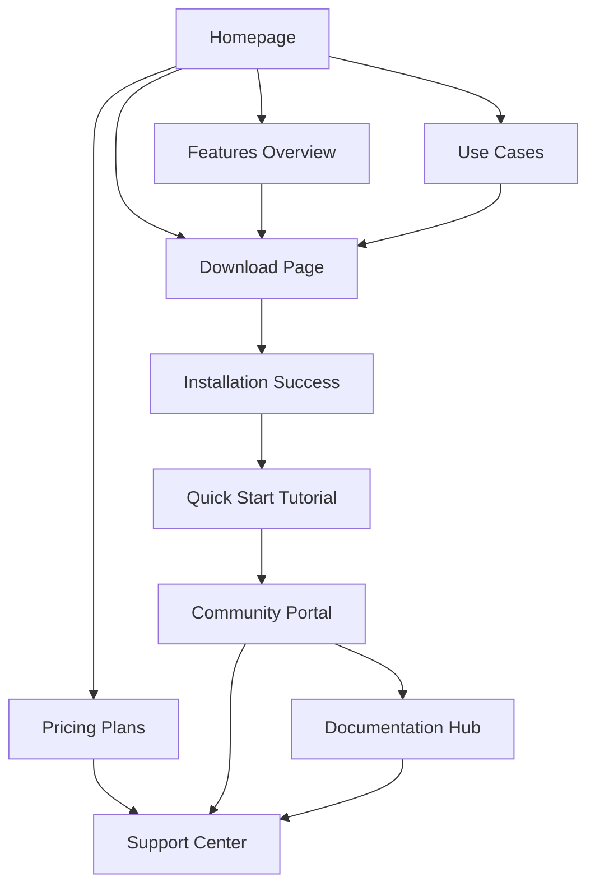

# LoOper Desktop Automation Platform - Product Requirements Document

## 1. Product Overview

LoOper is the world's most advanced desktop automation platform that combines visual template matching, AI integration, and node-based workflow design to transform repetitive tasks into intelligent, reliable automation sequences.

The platform addresses the critical need for accessible automation solutions across business processes, software testing, content creation, and IT operations, targeting users who require powerful automation capabilities without extensive programming knowledge.

LoOper aims to capture the growing desktop automation market by offering unique visual intelligence capabilities and local AI integration, positioning itself as the premier no-code automation solution for enterprises and small businesses alike.

## 2. Core Features

### 2.1 User Roles

| Role | Registration Method | Core Permissions |
|------|---------------------|------------------|
| Free User | Email registration | Access to basic automation features, limited workflows, community templates |
| Pro User | Subscription upgrade | Advanced AI features, unlimited workflows, priority support, custom integrations |
| Enterprise User | Enterprise license | Team collaboration, advanced security, API access, custom deployment options |
| Community Contributor | Verified account | Template sharing, tutorial creation, community moderation privileges |

### 2.2 Feature Module

Our LoOper platform requirements consist of the following main pages:

1. **Homepage**: Hero section with animated demo, key benefits showcase, social proof testimonials, primary CTA buttons
2. **Features Overview**: Visual automation engine, AI-powered intelligence, node-based workflow designer, advanced recording system
3. **Use Cases & Industries**: Business process automation, software testing, content creation, IT operations with detailed examples
4. **Download & Installation**: Automated installer download, system requirements, installation guide, quick start tutorial
5. **Documentation Hub**: Technical documentation, API references, integration guides, troubleshooting resources
6. **Community Portal**: User forums, template library, video tutorials, best practices sharing
7. **Pricing & Plans**: Feature comparison, subscription options, enterprise solutions, free trial access
8. **Support Center**: Help desk, knowledge base, contact information, live chat integration

### 2.3 Page Details

| Page Name | Module Name | Feature Description |
|-----------|-------------|---------------------|
| Homepage | Hero Section | Display animated demo showing recording → visual workflow → AI-powered execution with compelling tagline |
| Homepage | Key Benefits | Showcase visual automation, AI integration, no-code workflow design with interactive elements |
| Homepage | Social Proof | Present use cases from different industries with testimonials and success metrics |
| Homepage | CTA Section | Provide prominent "Download Free" and "Try Demo" buttons with conversion tracking |
| Features Overview | Visual Automation Engine | Detail computer vision-powered template matching, screenshot-based recording, intelligent fallbacks |
| Features Overview | AI-Powered Intelligence | Explain local LLM integration, vision-capable models, dynamic decision making, screen analysis |
| Features Overview | Node-Based Designer | Showcase drag-and-drop interface, visual workflow creation, conditional logic, real-time monitoring |
| Features Overview | Recording System | Highlight smart action grouping, automatic screenshots, scroll detection, keyboard recognition |
| Use Cases | Business Process | Present data entry automation, report generation, email workflows, CRM management examples |
| Use Cases | Software Testing | Show UI testing automation, regression testing, cross-platform testing, performance monitoring |
| Use Cases | Content Creation | Demonstrate social media posting, bulk processing, document generation, video workflows |
| Use Cases | IT Operations | Display system monitoring, backup automation, software deployment, maintenance tasks |
| Download | Installer Download | Provide automated installer with system detection, download tracking, installation verification |
| Download | System Requirements | List minimum and recommended specifications, compatibility information, troubleshooting tips |
| Documentation | Installation Guide | Offer step-by-step installation process, configuration options, initial setup wizard |
| Documentation | API Documentation | Provide comprehensive API references, code examples, integration tutorials |
| Documentation | Troubleshooting | Include common issues, solutions, diagnostic tools, support contact information |
| Community | User Forums | Enable discussion boards, Q&A sections, community moderation, user reputation system |
| Community | Template Library | Allow template sharing, categorization, rating system, download tracking |
| Community | Video Tutorials | Host educational content, step-by-step guides, advanced techniques, user submissions |
| Pricing | Plan Comparison | Display feature matrix, pricing tiers, upgrade options, enterprise contact form |
| Support | Help Desk | Integrate ticketing system, knowledge base search, live chat, contact forms |

## 3. Core Process

**New User Flow:**
Users discover LoOper through marketing channels, visit the homepage to understand core value propositions, explore features and use cases, download the free version, complete installation using the automated installer, access quick start tutorials, create their first automation workflow, and optionally upgrade to pro features.

**Existing User Flow:**
Returning users access the community portal for templates and tutorials, utilize the documentation hub for advanced features, participate in forums for support and knowledge sharing, and manage their subscription through the pricing portal.

**Enterprise User Flow:**
Enterprise prospects explore advanced features, contact sales through dedicated forms, receive custom demonstrations, negotiate enterprise licensing, implement team deployment, and access priority support channels.

## 4. User Interface Design

### 4.1 Design Style

- **Primary Colors**: Deep Orange (#FF6B35) for automation and energy, Dark Blue (#1E3A8A) for intelligence and reliability
- **Secondary Colors**: Bright Green (#10B981) for success and efficiency, Charcoal (#374151) and Light Gray (#F3F4F6) for neutral elements
- **Button Style**: Modern rounded buttons with subtle shadows and hover animations, gradient effects for primary CTAs
- **Typography**: Inter/Poppins for headlines (24px-48px), Open Sans/Source Sans Pro for body text (16px-18px), JetBrains Mono for code snippets (14px)
- **Layout Style**: Card-based design with clean spacing, top navigation with sticky behavior, grid layouts for feature showcases
- **Icons & Animations**: Minimalist tech-focused icons, isometric automation workflow illustrations, smooth transitions showing automation in action

### 4.2 Page Design Overview

| Page Name | Module Name | UI Elements |
|-----------|-------------|-------------|
| Homepage | Hero Section | Full-width animated background, centered headline with gradient text, floating demo video player, dual CTA buttons with contrasting colors |
| Homepage | Benefits Grid | Three-column card layout, icon + headline + description format, hover effects with subtle animations, consistent spacing |
| Features | Feature Cards | Alternating left-right layout, large feature images, detailed descriptions, interactive demo buttons, progress indicators |
| Use Cases | Industry Tabs | Horizontal tab navigation, content switching animations, case study cards with metrics, testimonial integration |
| Download | Download Center | Prominent download button, system auto-detection display, progress indicators, installation preview screenshots |
| Documentation | Sidebar Navigation | Collapsible menu structure, search functionality, breadcrumb navigation, syntax-highlighted code blocks |
| Community | Forum Layout | Thread-based discussion view, user avatars and reputation, voting system, category filtering, responsive design |
| Pricing | Comparison Table | Feature matrix with checkmarks, highlighted recommended plan, toggle for monthly/annual pricing, enterprise contact form |

### 4.3 Responsiveness

The website follows a desktop-first approach with comprehensive mobile adaptation. Touch interaction optimization includes larger tap targets (minimum 44px), swipe gestures for carousel navigation, and optimized form inputs for mobile devices. Breakpoints are set at 768px (tablet) and 1024px (desktop) with fluid scaling between breakpoints. All interactive elements maintain accessibility standards with proper focus states and keyboard navigation support.