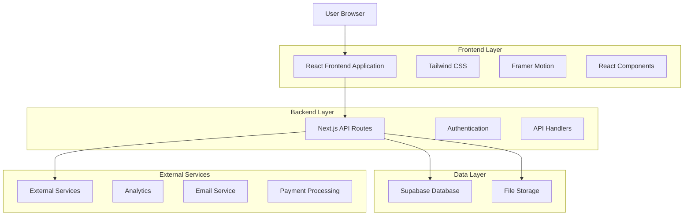
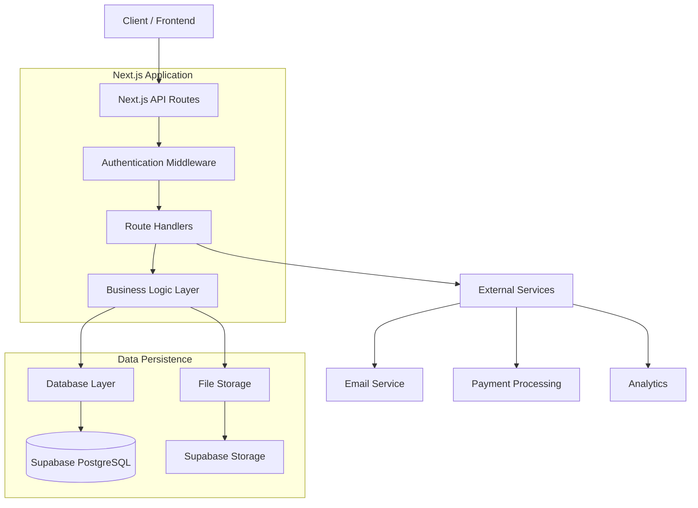
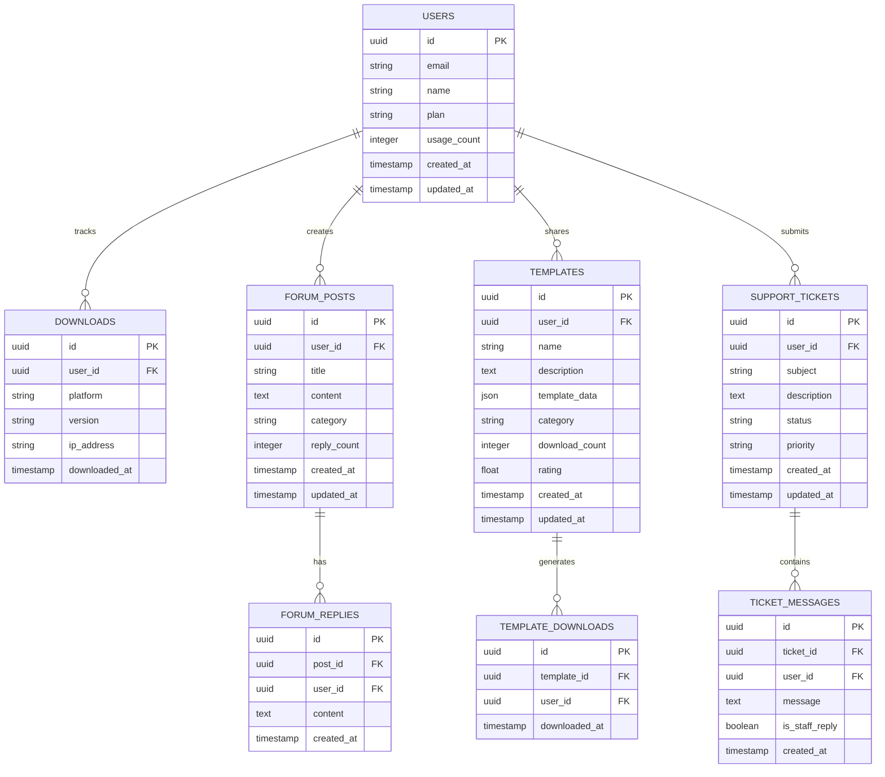

# LoOper Desktop Automation Platform - Technical Architecture Document

## 1. Architecture Design



## 2. Technology Description

* **Frontend**: React\@18 + Next.js\@14 + TypeScript + Tailwind CSS\@3 + Framer Motion\@10

* **Backend**: Next.js API Routes + Supabase

* **Database**: Supabase (PostgreSQL)

* **Authentication**: Supabase Auth

* **File Storage**: Supabase Storage

* **Deployment**: Vercel

* **Analytics**: Vercel Analytics + Google Analytics

* **Email**: Resend or SendGrid

* **Payments**: Stripe

## 3. Route Definitions

| Route                          | Purpose                                                            |
| ------------------------------ | ------------------------------------------------------------------ |
| /                              | Homepage with hero section, key benefits, and primary CTAs         |
| /features                      | Features overview showcasing automation engine and AI capabilities |
| /features/visual-automation    | Detailed visual automation engine documentation                    |
| /features/ai-intelligence      | AI-powered intelligence features and capabilities                  |
| /features/workflow-designer    | Node-based workflow designer interface details                     |
| /features/recording-system     | Advanced recording system specifications                           |
| /use-cases                     | Industry-specific use cases and examples                           |
| /use-cases/business-automation | Business process automation solutions                              |
| /use-cases/software-testing    | Software testing automation use cases                              |
| /use-cases/content-creation    | Content creation workflow examples                                 |
| /use-cases/it-operations       | IT operations automation scenarios                                 |
| /download                      | Download page with installer and system requirements               |
| /docs                          | Documentation hub with installation and API guides                 |
| /docs/installation             | Step-by-step installation guide                                    |
| /docs/api                      | Comprehensive API documentation                                    |
| /docs/integrations             | Third-party integration guides                                     |
| /docs/troubleshooting          | Common issues and solutions                                        |
| /community                     | Community portal with forums and templates                         |
| /community/forums              | User discussion forums                                             |
| /community/templates           | Shared automation templates library                                |
| /community/tutorials           | Video tutorials and guides                                         |
| /pricing                       | Pricing plans and subscription options                             |
| /support                       | Support center with help desk and knowledge base                   |
| /auth/login                    | User authentication login page                                     |
| /auth/register                 | User registration and account creation                             |
| /auth/reset-password           | Password reset functionality                                       |
| /dashboard                     | User dashboard for account management                              |
| /admin                         | Administrative interface for content management                    |

## 4. API Definitions

### 4.1 Core API

**User Authentication**

```
POST /api/auth/login
```

Request:

| Param Name | Param Type | isRequired | Description                |
| ---------- | ---------- | ---------- | -------------------------- |
| email      | string     | true       | User email address         |
| password   | string     | true       | User password (plain text) |

Response:

| Param Name | Param Type | Description              |
| ---------- | ---------- | ------------------------ |
| success    | boolean    | Authentication status    |
| user       | object     | User profile information |
| token      | string     | JWT authentication token |

Example:

```json
{
  "email": "user@example.com",
  "password": "securepassword123"
}
```

**Download Tracking**

```
POST /api/downloads/track
```

Request:

| Param Name | Param Type | isRequired | Description                          |
| ---------- | ---------- | ---------- | ------------------------------------ |
| platform   | string     | true       | Operating system (windows/mac/linux) |
| version    | string     | true       | Software version being downloaded    |
| user\_id   | string     | false      | User ID if authenticated             |

**Template Management**

```
GET /api/templates
POST /api/templates
PUT /api/templates/:id
DELETE /api/templates/:id
```

**Community Forums**

```
GET /api/forums/posts
POST /api/forums/posts
GET /api/forums/posts/:id
POST /api/forums/posts/:id/replies
```

**Support Tickets**

```
POST /api/support/tickets
GET /api/support/tickets
PUT /api/support/tickets/:id
```

## 5. Server Architecture Diagram



## 6. Data Model

### 6.1 Data Model Definition



### 6.2 Data Definition Language

**Users Table**

```sql
-- Create users table
CREATE TABLE users (
    id UUID PRIMARY KEY DEFAULT gen_random_uuid(),
    email VARCHAR(255) UNIQUE NOT NULL,
    name VARCHAR(100) NOT NULL,
    plan VARCHAR(20) DEFAULT 'free' CHECK (plan IN ('free', 'pro', 'enterprise')),
    usage_count INTEGER DEFAULT 0,
    created_at TIMESTAMP WITH TIME ZONE DEFAULT NOW(),
    updated_at TIMESTAMP WITH TIME ZONE DEFAULT NOW()
);

-- Enable RLS
ALTER TABLE users ENABLE ROW LEVEL SECURITY;

-- Create policies
CREATE POLICY "Users can view own profile" ON users
    FOR SELECT USING (auth.uid() = id);

CREATE POLICY "Users can update own profile" ON users
    FOR UPDATE USING (auth.uid() = id);

-- Grant permissions
GRANT SELECT ON users TO anon;
GRANT ALL PRIVILEGES ON users TO authenticated;
```

**Downloads Table**

```sql
-- Create downloads table
CREATE TABLE downloads (
    id UUID PRIMARY KEY DEFAULT gen_random_uuid(),
    user_id UUID REFERENCES users(id),
    platform VARCHAR(20) NOT NULL CHECK (platform IN ('windows', 'mac', 'linux')),
    version VARCHAR(20) NOT NULL,
    ip_address INET,
    downloaded_at TIMESTAMP WITH TIME ZONE DEFAULT NOW()
);

-- Create indexes
CREATE INDEX idx_downloads_user_id ON downloads(user_id);
CREATE INDEX idx_downloads_platform ON downloads(platform);
CREATE INDEX idx_downloads_downloaded_at ON downloads(downloaded_at DESC);

-- Enable RLS
ALTER TABLE downloads ENABLE ROW LEVEL SECURITY;

-- Grant permissions
GRANT SELECT ON downloads TO anon;
GRANT ALL PRIVILEGES ON downloads TO authenticated;
```

**Forum Posts Table**

```sql
-- Create forum_posts table
CREATE TABLE forum_posts (
    id UUID PRIMARY KEY DEFAULT gen_random_uuid(),
    user_id UUID REFERENCES users(id) NOT NULL,
    title VARCHAR(200) NOT NULL,
    content TEXT NOT NULL,
    category VARCHAR(50) NOT NULL,
    reply_count INTEGER DEFAULT 0,
    created_at TIMESTAMP WITH TIME ZONE DEFAULT NOW(),
    updated_at TIMESTAMP WITH TIME ZONE DEFAULT NOW()
);

-- Create indexes
CREATE INDEX idx_forum_posts_user_id ON forum_posts(user_id);
CREATE INDEX idx_forum_posts_category ON forum_posts(category);
CREATE INDEX idx_forum_posts_created_at ON forum_posts(created_at DESC);

-- Enable RLS
ALTER TABLE forum_posts ENABLE ROW LEVEL SECURITY;

-- Create policies
CREATE POLICY "Anyone can view forum posts" ON forum_posts
    FOR SELECT USING (true);

CREATE POLICY "Authenticated users can create posts" ON forum_posts
    FOR INSERT WITH CHECK (auth.uid() = user_id);

CREATE POLICY "Users can update own posts" ON forum_posts
    FOR UPDATE USING (auth.uid() = user_id);

-- Grant permissions
GRANT SELECT ON forum_posts TO anon;
GRANT ALL PRIVILEGES ON forum_posts TO authenticated;
```

**Templates Table**

```sql
-- Create templates table
CREATE TABLE templates (
    id UUID PRIMARY KEY DEFAULT gen_random_uuid(),
    user_id UUID REFERENCES users(id) NOT NULL,
    name VARCHAR(100) NOT NULL,
    description TEXT,
    template_data JSONB NOT NULL,
    category VARCHAR(50) NOT NULL,
    download_count INTEGER DEFAULT 0,
    rating DECIMAL(3,2) DEFAULT 0.00,
    created_at TIMESTAMP WITH TIME ZONE DEFAULT NOW(),
    updated_at TIMESTAMP WITH TIME ZONE DEFAULT NOW()
);

-- Create indexes
CREATE INDEX idx_templates_user_id ON templates(user_id);
CREATE INDEX idx_templates_category ON templates(category);
CREATE INDEX idx_templates_rating ON templates(rating DESC);
CREATE INDEX idx_templates_download_count ON templates(download_count DESC);

-- Enable RLS
ALTER TABLE templates ENABLE ROW LEVEL SECURITY;

-- Create policies
CREATE POLICY "Anyone can view templates" ON templates
    FOR SELECT USING (true);

CREATE POLICY "Authenticated users can create templates" ON templates
    FOR INSERT WITH CHECK (auth.uid() = user_id);

CREATE POLICY "Users can update own templates" ON templates
    FOR UPDATE USING (auth.uid() = user_id);

-- Grant permissions
GRANT SELECT ON templates TO anon;
GRANT ALL PRIVILEGES ON templates TO authenticated;
```

**Support Tickets Table**

```sql
-- Create support_tickets table
CREATE TABLE support_tickets (
    id UUID PRIMARY KEY DEFAULT gen_random_uuid(),
    user_id UUID REFERENCES users(id) NOT NULL,
    subject VARCHAR(200) NOT NULL,
    description TEXT NOT NULL,
    status VARCHAR(20) DEFAULT 'open' CHECK (status IN ('open', 'in_progress', 'resolved', 'closed')),
    priority VARCHAR(20) DEFAULT 'medium' CHECK (priority IN ('low', 'medium', 'high', 'urgent')),
    created_at TIMESTAMP WITH TIME ZONE DEFAULT NOW(),
    updated_at TIMESTAMP WITH TIME ZONE DEFAULT NOW()
);

-- Create indexes
CREATE INDEX idx_support_tickets_user_id ON support_tickets(user_id);
CREATE INDEX idx_support_tickets_status ON support_tickets(status);
CREATE INDEX idx_support_tickets_priority ON support_tickets(priority);

-- Enable RLS
ALTER TABLE support_tickets ENABLE ROW LEVEL SECURITY;

-- Create policies
CREATE POLICY "Users can view own tickets" ON support_tickets
    FOR SELECT USING (auth.uid() = user_id);

CREATE POLICY "Users can create tickets" ON support_tickets
    FOR INSERT WITH CHECK (auth.uid() = user_id);

-- Grant permissions
GRANT ALL PRIVILEGES ON support_tickets TO authenticated;
```

